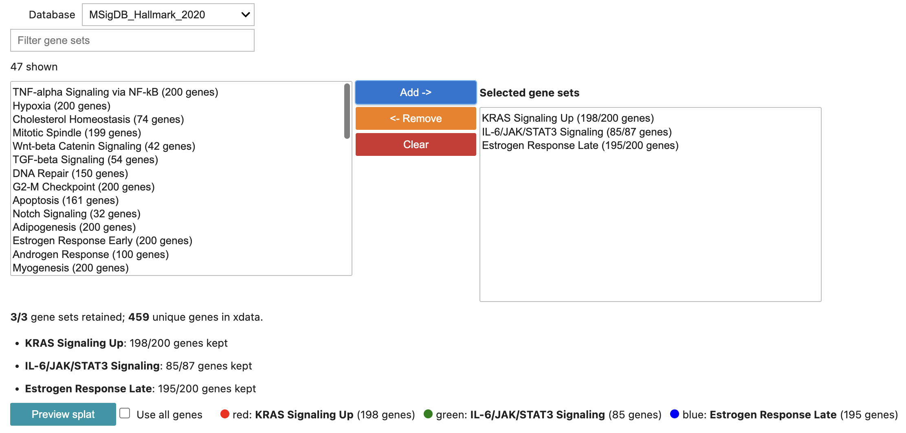

Gene Sets
=========

Xentools includes a small curated gene-set archive and a picker interface for
selecting signatures against a reference ``XenData`` object.

The intended workflow is:

1. Launch a picker with ``xdata.gene_set_picker()``.
2. Select gene sets interactively, or with ``search()`` and ``add()``.
3. Use ``xdata.picked_gene_sets`` directly in plotting or Scanpy functions.

Basic Workflow
--------------

.. code-block:: python

   import xentools

   xdata = xentools.XenData("/path/to/xenium/outs")
   xdata.gene_set_picker()

In a Jupyter notebook, this opens the interactive picker widget. As selections
change, Xentools stores the filtered output dictionary at
``xdata.picked_gene_sets``.

After selecting gene sets:

.. code-block:: python

   xdata.picked_gene_sets

``xdata.picked_gene_sets`` is a regular ``dict[str, list[str]]``. It is already
converted between human and mouse when needed and filtered to genes present in
``xdata.adata.var_names``.

Use the selected gene sets in a Xentools splat:

.. code-block:: python

   xdata.plot_splat(genes=xdata.picked_gene_sets)

Or use the same dictionary in Scanpy-style plotting:

.. code-block:: python

   import scanpy as sc

   sc.pl.dotplot(xdata.adata, xdata.picked_gene_sets, groupby="Cluster")

The picker does not limit the number of selected gene sets. If a plotting
function can only display a subset, that plotting function is responsible for
raising a clear error.

Non-Widget Environments
-----------------------

If widgets are unavailable, the picker still works programmatically:

.. code-block:: python

   picker = xdata.gene_set_picker()

   picker.search("hypoxia")
   picker.add("MSigDB_Hallmark_2020", "Hypoxia")
   picker.add("MSigDB_Hallmark_2020", "Epithelial Mesenchymal Transition")

   xdata.plot_splat(genes=xdata.picked_gene_sets)

Useful Picker Attributes
------------------------

``xdata.picked_gene_sets``
    The selected gene sets after species conversion and filtering to
    ``xdata``. This is the simplest output to pass to plotting functions.

``picker.gene_sets``
    The same selected dictionary, accessed from the picker object returned by
    ``xdata.gene_set_picker()``.

``picker.genes``
    Flat deduplicated list of all genes in ``picker.gene_sets``.

``picker.raw_gene_sets``
    Selected gene sets before species conversion and dataset filtering.

``picker.converted_gene_sets``
    Selected gene sets after species conversion but before filtering to the
    Xenium panel.

``picker.coverage``
    DataFrame summarizing how many genes were retained for each selected set.

``picker.dropped``
    Subset of ``picker.coverage`` for gene sets dropped because too few genes
    remained.

Species Conversion
------------------

By default, the picker attempts to infer species from the selected gene-set
library and from ``xdata.adata.var_names``:

.. code-block:: python

   picker = xentools.gene_sets.pick(
       xdata,
       source_species="auto",
       target_species="auto",
   )

If your dataset or library is ambiguous, pass species explicitly:

.. code-block:: python

   picker = xentools.gene_sets.pick(
       xdata,
       source_species="human",
       target_species="mouse",
       ortholog_strategy="best",
   )

Human-mouse conversion uses the MGI homology table and caches it under
``~/.cache/xentools`` on first use.

Bundled Library
---------------

The bundled curated archive is intentionally small enough to ship with
Xentools. It can be inspected directly when needed:

.. code-block:: python

   lib = xentools.gene_sets.load_curated_gene_sets()
   lib.databases
   lib.search("hypoxia")

Most users should use ``pick(xdata)`` instead of opening the library directly.

Building a Custom HDF5 Archive
------------------------------

You can download tab-delimited ``.txt`` gene-set libraries from Enrichr and
bundle them into the same compact HDF5 format:

.. code-block:: python

   from xentools.gene_sets import build_gene_set_h5

   build_gene_set_h5(
       input_dir="/path/to/enrichr_txt_files",
       output_path="/path/to/my_gene_sets.h5",
       overwrite=True,
   )

Then point the picker to the custom archive:

.. code-block:: python

   picker = xentools.gene_sets.pick(
       xdata,
       path="/path/to/my_gene_sets.h5",
   )

The module-level ``xentools.gene_sets.pick(xdata, ...)`` function is equivalent
to ``xdata.gene_set_picker(...)`` and remains useful when writing code that
does not assume a method on the object.

API Summary
-----------

.. autosummary::

   xentools.gene_sets.pick
   xentools.gene_sets.GeneSetPicker
   xentools.gene_sets.build_gene_set_h5
   xentools.gene_sets.load_curated_gene_sets
   xentools.gene_sets.prepare_for_xendata
   xentools.gene_sets.convert_gene_sets_species
