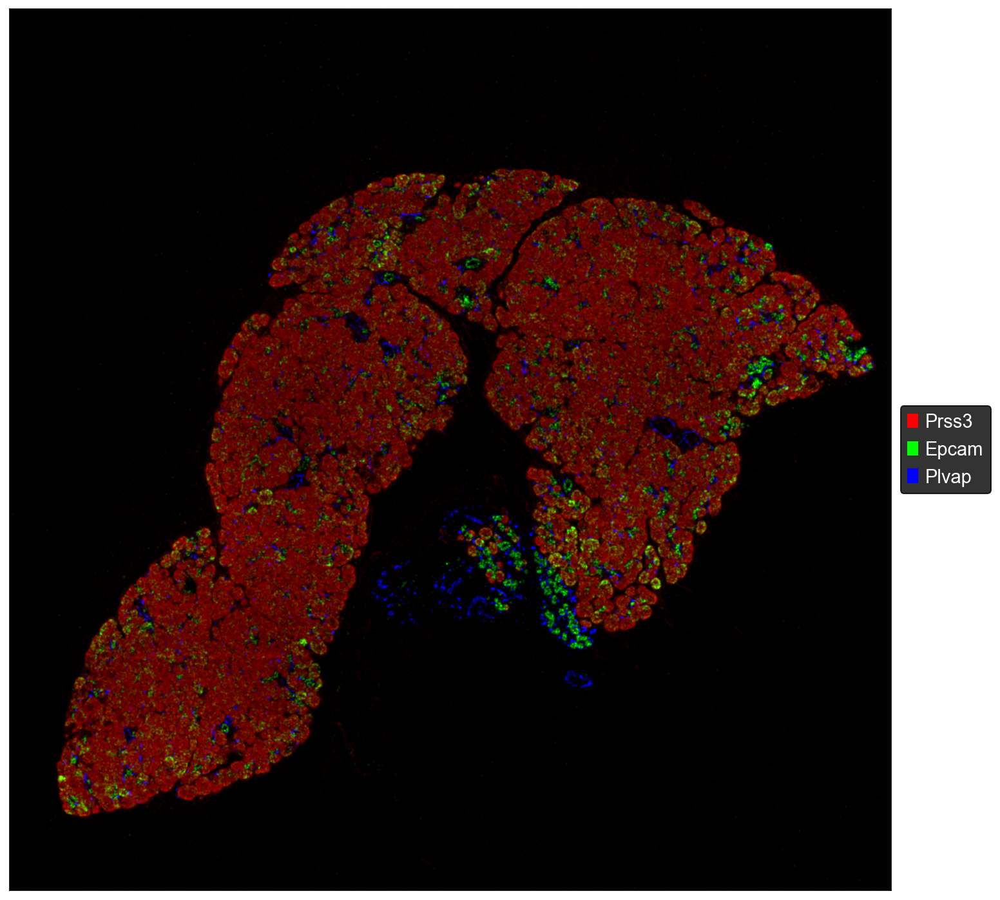
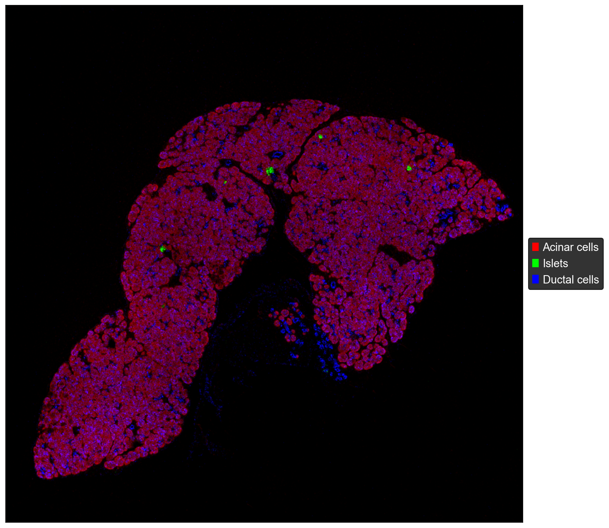
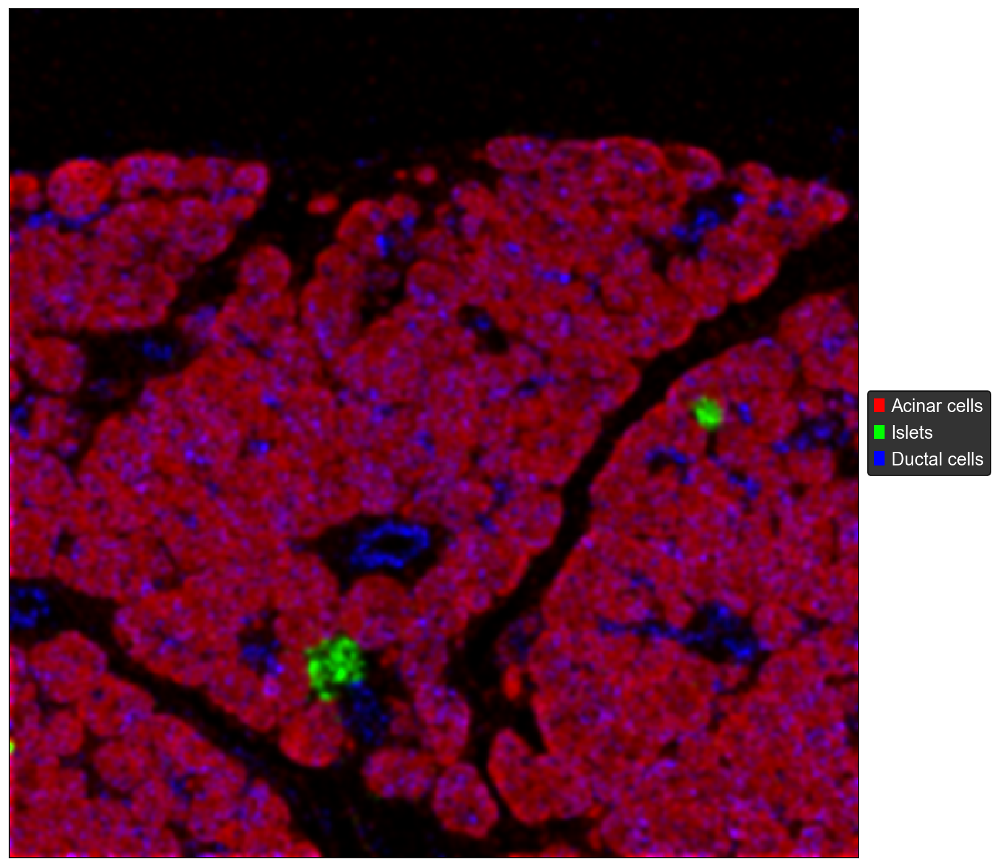
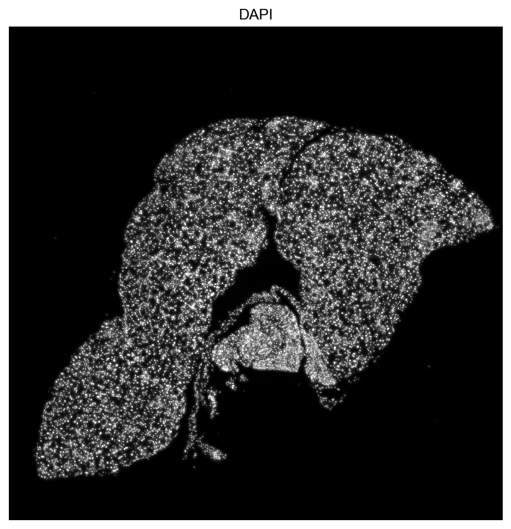

Quickstart
==========

Load a Dataset
--------------

Create a :class:`xentools.XenData` object from a Xenium-style output folder:

.. code-block:: python

   import xentools

   xdata = xentools.XenData("/path/to/xe_outs")
   xdata

Example output:

.. code-block:: text

   XenData object: MousePancreas_0056768_Region_1
   Folder             /path/to/Preall_Lab/output-MousePancreas_0056768_Region_1__Region_1/
   Transcripts        `trans`: DataFrame[parquet] (11900926, 13)
   Expression         `adata`: AnnData (22601, 479)
   Clusters           `clusters`: DataFrame (22601, 10)
   Boundaries         `cell_boundaries`: GeoDataFrame (parquet, lazy)
                     `nucleus_boundaries`: GeoDataFrame (parquet, lazy)
   Images             `images['DAPI']`, `protein_images` (1 channels)
   ROIs               `ROIs`: 1 selections, 0 classes; active=`all`
   Common accessors:
   `xdata.trans`, `xdata.adata`, `xdata.clusters`, `xdata.cell_boundaries`,
   `xdata.nucleus_boundaries`, `xdata.rois`, `xdata.images`

``XenData`` reads the cell-feature matrix, cell metadata, image metadata,
cluster assignments when present, transcript metadata, and boundary metadata.
Large transcript or boundary tables may remain lazy until queried.

Plot Transcript Splats
----------------------

Most plotting methods can be used directly in a notebook without assigning the
returned Matplotlib axes object. Start this way when you just want to look at
the data.

Plot one or more genes as smoothed transcript-density channels:

.. code-block:: python

   xdata.plot_splat(
       ["Prss3", "Epcam", "Plvap"],
       gains=[0.8, 1.5, 2],
   );

Plot whole gene sets together using a dictionary of gene lists:

.. code-block:: python

   gene_dict = {
       "Acinar cells": ["Try10", "Prss3"],
       "Islets": ["Insm1", "Neurod1", "Scg2", "Chgb"],
       "Ductal cells": ["Cftr", "Muc1", "Cldn10", "Sox9"],
   }

   xdata.plot_splat(
       gene_dict,
       gains=[0.8, 1.5, 2],
   );

Specify bounds to zoom in on a region of the splat:

.. code-block:: python

   bounds = (1200, 1800, 300, 900)

   xdata.plot_splat(
       gene_dict,
       gains=[1.5, 1.5, 2],
       bounds=bounds,
   );

If you want the rendered image array for downstream work, request it
explicitly:

.. code-block:: python

   arr = xdata.plot_splat(["EPCAM", "KRT19"], return_array=True)

Show Images
-----------

Display a morphology or protein image channel:

.. code-block:: python

   xdata.plot_image("DAPI", level=3);

Layer Plots on Matplotlib Axes
------------------------------

The plotting functions return a Matplotlib axes object. You can ignore it for a
single plot, or assign it and pass it into another plotting function to build a
simple overlay.

For example, plot a splat and then draw cell boundaries on the same axes:

.. code-block:: python

   ax = xdata.plot_splat(["EPCAM", "KRT19"])
   xdata.plot_cells(ax=ax, color_by="Cluster");

The same pattern works for image overlays:

.. code-block:: python

   bounds = (500, 1500, 900, 1900)

   ax = xdata.plot_image("DAPI", level=2, bounds=bounds)
   xdata.plot_splat(
       ["C7", "Epcam", "Tagln"],
       gains=[3, 3, 3],
       bounds=bounds,
       ax=ax,
   )
   xdata.plot_cells(ax=ax, bounds=bounds);

This Matplotlib-style approach is useful for quick customization. For more
complex composites, use ``render``.

Render Composite Views
----------------------

Use ``render`` when combining images, transcript splats, points, and cell
boundaries. It standardizes layer order and blending so images, splats, points,
and cells stay visually consistent:

.. code-block:: python

   ax = xdata.render(
       images={"DAPI": {"level": 3, "alpha": 0.4}},
       splat={"genes": ["EPCAM", "KRT19"], "gains": [2, 2]},
       points={"genes": ["CD3D"], "max_points": 20_000, "color": "cyan"},
       cells=True,
       save="figures/composite.png",
   )

Plot Cells by Expression
------------------------

Fill cell polygons by expression of one gene or the summed expression of a gene
set:

.. code-block:: python

   ax = xdata.plot_cells(genes="EPCAM", cmap="magma")
   ax = xdata.plot_cells(genes=["EPCAM", "KRT19"], cmap="magma")

Work with ROIs
--------------

Load a GeoJSON ROI file at initialization:

.. code-block:: python

   xdata = xentools.XenData(
       "/path/to/xe_outs",
       roi_file="/path/to/annotation.geojson",
   )

Set the active ROI and plot within that region:

.. code-block:: python

   xdata.set_active_roi("Tumor")
   ax = xdata.plot_splat(["EPCAM", "KRT19"])
   xdata.plot_boundaries(kind="cell", ax=ax)

Create a new ROI manually:

.. code-block:: python

   roi = xentools.ROI.from_bounds(2000, 12000, 2000, 4000, name="custom")
   xdata.rois["custom"] = roi
   xdata.set_active_roi("custom")
